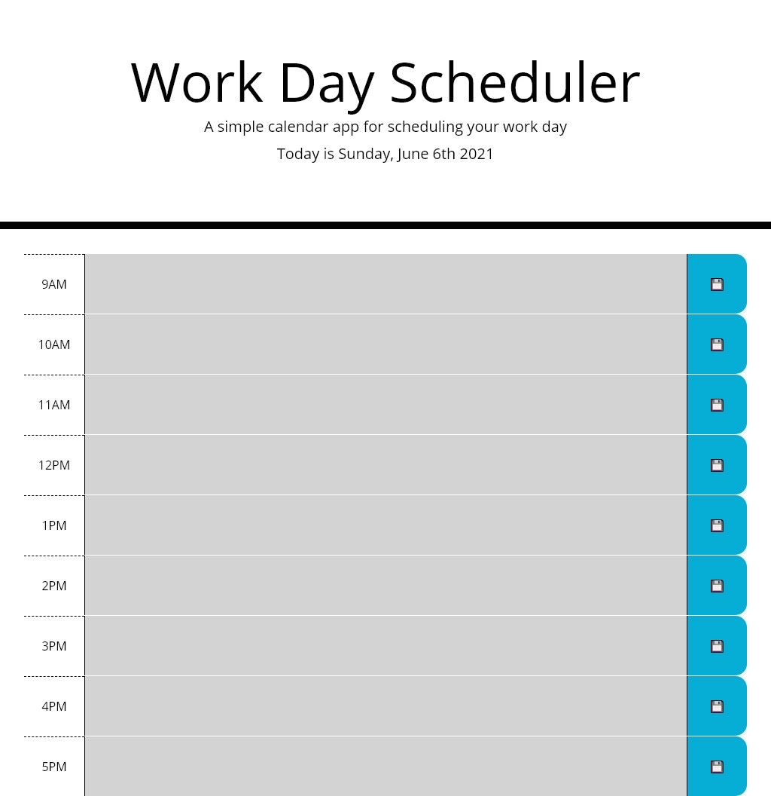

# work-day-scheduler

## Description
This a simple calendar app for scheduling user's work day. The web app displays working hours from 9AM - 5PM and color them according to the client time to indicate whether the time block is in the past, present and future.

User can event information regarding their event into any of the text area from 9AM - 5PM and save the event to Local Storage. Upon returning to the web app, the web app will check Local Storage and display the saved events.

## Screenshot of the Application

## Link to Deployed Application
https://ywkuo227.github.io/work-day-scheduler/

## Features
- The code will verify if a previous event exist in Local Storage for the hour the user is saving a new event to. If exist, the code will replace the event information. Otherwise, the event will be added to Local Storage as new event.

## Credit
Array Find() Method - W3Schools - https://www.w3schools.com/jsref/jsref_find.asp#:~:text=%20JavaScript%20Array%20find%20%28%29%20Method%20%201,Details.%20%206%20More%20Examples.%20%20More%20

## Challenge
- Considering to sort the stored events based on the order of the hour (AM to PM). However, due to the textarea id is set as hour-x (string+number), I decided not to pursue the optimization at this time. On the other hand, the data set is small enough and should not cause a latency in loading the stored events and display them in HTML in time.